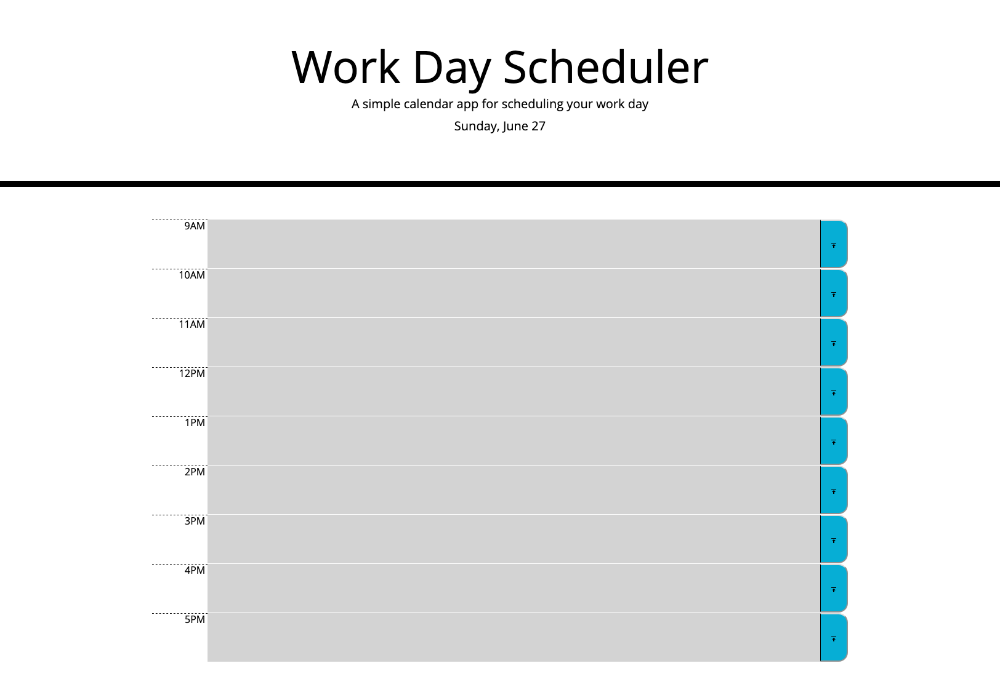
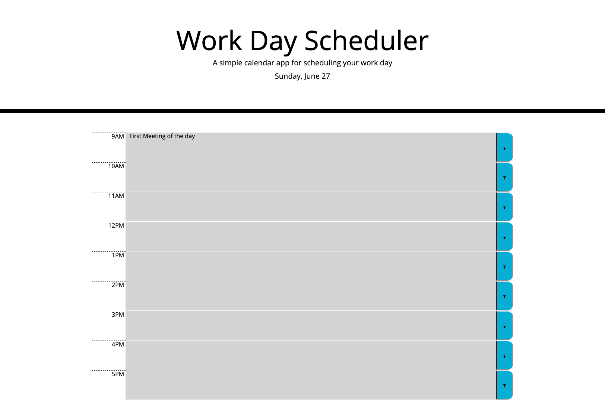
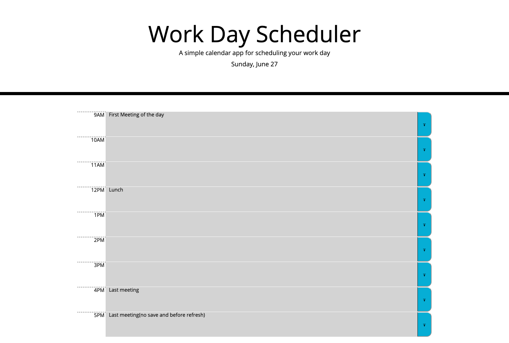

# workday-scheduler
Challenge 5 - Description: 
This challenge involves building a workday scheduler that is colour coded based on the current time of day. The events on the scheduler are 
editable by the user and the user can edit them as easily as clicking on the timeblock that they wish to edit. When the user is done with editing 
the event, they can hit the save button on the right to save their event. Since the events are stored in localstorage, they are persistent even 
if the user refreshes or closes the page.

Screenshot: 

URL: https://askarrizvi.github.io/workday-scheduler/
